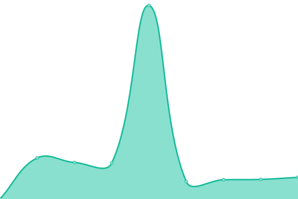

# [📈 Live Status](https://status.fugapedia.xyz): <!--live status--> **🟧 Partial outage**

This repository contains the open-source uptime monitor and status page for [Upptime](https://upptime.js.org), powered by [Upptime](https://github.com/upptime/upptime).

With [Upptime](https://upptime.js.org), you can get your own unlimited and free uptime monitor and status page, powered entirely by a GitHub repository. We use [Issues](https://github.com/upptime/upptime/issues) as incident reports, [Actions](https://github.com/upptime/upptime/actions) as uptime monitors, and [Pages](https://status.fugapedia.xyz) for the status page.

<!--start: status pages-->
<!-- This summary is generated by Upptime (https://github.com/upptime/upptime) -->
<!-- Do not edit this manually, your changes will be overwritten -->
<!-- prettier-ignore -->
| URL | Status | History | Response Time | Uptime |
| --- | ------ | ------- | ------------- | ------ |
|  [Fugapedia Core](https://fugapedia.xyz) | 🟩 Up | [fugapedia-core.yml](https://github.com/YarichLTD/fugapediastatus/commits/HEAD/history/fugapedia-core.yml) | 

 707ms
     
 | 

<a href="https://yarichltd.github.io/fugapediastatus/history/fugapedia-core">100.00%</a>
    

|  [Fugapedia Wiki](https://wiki.fugapedia.xyz) | 🟩 Up | [fugapedia-wiki.yml](https://github.com/YarichLTD/fugapediastatus/commits/HEAD/history/fugapedia-wiki.yml) | 

 1206ms
     
 | 

<a href="https://yarichltd.github.io/fugapediastatus/history/fugapedia-wiki">100.00%</a>
    

|  [Fugapedia Books](https://books.fugapedia.xyz) | 🟩 Up | [fugapedia-books.yml](https://github.com/YarichLTD/fugapediastatus/commits/HEAD/history/fugapedia-books.yml) | 

 792ms
     
 | 

<a href="https://yarichltd.github.io/fugapediastatus/history/fugapedia-books">100.00%</a>
    

|  [Fugapedia Books (Old)](https://fugapedia.xyz/ebooks/) | 🟥 Down | [fugapedia-books-old.yml](https://github.com/YarichLTD/fugapediastatus/commits/HEAD/history/fugapedia-books-old.yml) | 

 153ms
     
 | 

<a href="https://yarichltd.github.io/fugapediastatus/history/fugapedia-books-old">100.00%</a>
    

<!--end: status pages-->

[**Visit our status website →**](https://status.fugapedia.xyz)

## 📄 License

- Powered by: [Upptime](https://github.com/upptime/upptime)
- Code: [MIT](./LICENSE) © [Upptime](https://upptime.js.org)
- Data in the `./history` directory: [Open Database License](https://opendatacommons.org/licenses/odbl/1-0/)
